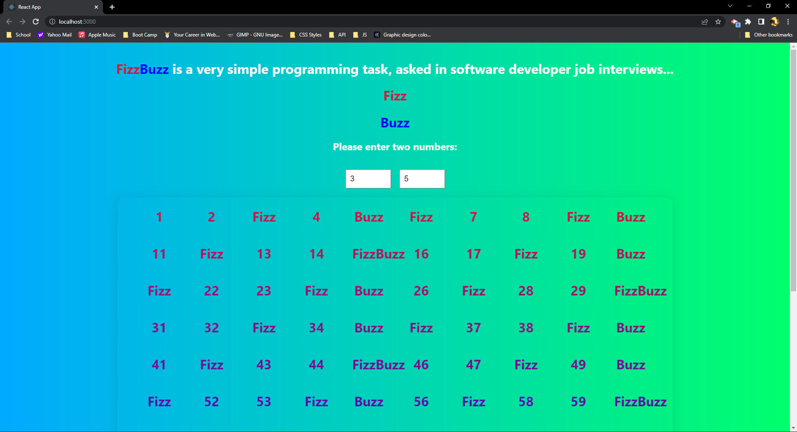

# Fizz-Buzz

## Table of Contents

- [Description](#description)
- [Installation](#installation)
- [Usage](#usage)
- [License](#license)
- [Contributors](#Contributors)

## Description:

- FizzBuzz is a very simple programming task, asked in software development jobs. The purpose of this game is to teach division using two starting numbers. Whenever a number is divisable buy one or both numbers, the word changes to Fizz, Buzz or FizzBuzz in its place. With the use of react and state change, the page will dynamically update everytime an input has changed to reflect the current numbers selected for FizzBuzz. 

## Installation

1. `git clone WixkedLuck/Fizz-Buzz`
2. run `npm start`

## Usage

- The purpose of this app is to show how to solve the programming task of FizzBuzz in react. 

GitHub URL: https://github.com/WixkedLuck/Fizz-Buzz

GitHub Pages: https://backstock-23.herokuapp.com/

## License

- N/A 

## Contributors

- WixkedLuck

## Test
- N/A  

_Screenshots of page_

[FizzBuzzVideo.webm](https://user-images.githubusercontent.com/91163168/197347996-a1270160-fb73-4adb-8d7e-cbfff41057df.webm)

